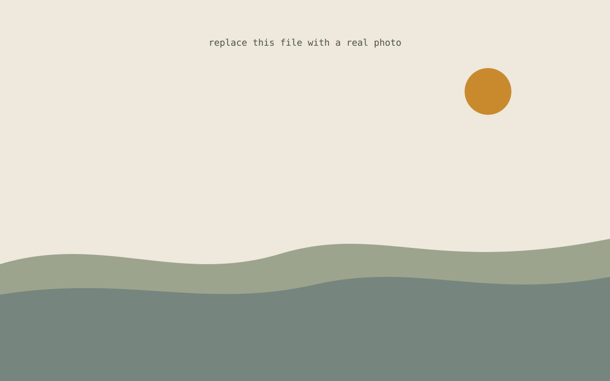

This is a placeholder post, set up as an example of a **page bundle** — a folder that holds both the article text and its images together.

To add a photo anywhere in the text, drop the image file into this same folder and reference it like this:

```

```

For example:



The text in the square brackets becomes the caption shown under the photo. You can add as many images as you like, anywhere in the article, mixed freely with paragraphs.

## Starting a new article

1. Duplicate this whole `welcome` folder and rename it, e.g. `content/articles/my-second-post/`
2. Replace `index.md` with your title, date, and summary, and write your text
3. Drop your photos into that same folder and reference them with ``
4. Push it to GitHub — it publishes automatically
